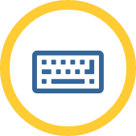

    <h1>Help for Mu</h1>
    
<a href="/">Mu</a> is a simple code editor for beginner
    programmers. It's written in Python and works on Windows, OSX, Linux and Raspberry Pi.

# Help

## Starting Mu

Coming soon... ;-)

## Mu Buttons

### New

Click the new button to start in a new file in mu. This won't damage your old files - a fresh place to work.

### Load

Load a file - your old work or some other python file to work on.

### Save

Saves your work so you can keep it for later and not loose it if you loose power. Do this often!

### Flash

Flash your code onto the Microbit. This is how you get your code to run!

### Files

Show the files on your Micropython.

### Repl

The repl is a way of typing stuff and seeing the microbit do something immediately. It is an abbreviation for "read-eval-print-loop".

### Zoom In

Make the letters bigger

### Zoom Out

Make the letters smaller

### Check

This button will check your code and underline errors you have made. Worth doing before you flash your code.

### Help

Show help - should be this help.

### Quit

Press this when you are done with Mu. Mu will make sure you've saved your work if you want to keep it.

# Advanced - settings file
The default behaviour of Mu is controlled through a settings.json file. By default this file is located in the application data directory, but a settings file in the same directory as the Mu application itself will take priority.

## Workspace settings
If you are using Mu on a Windows network and would like it to default to saving it's files to your users homedrive network shares then you can create a settings.json file like the one below. Obviously change your drive letters to match your environment!

## Runtime settings
By default, Mu uses a bundled version of the MicroPython runtime, but advanced users (e.g. those developing the Microbit runtime) can use the settings.json file to configure Mu to use their own runtime hex file.

To do this, add a line like this to the settings.json file:

"microbit_runtime_hex": "customhex.hex"

If the file name is not fully qualified then it will be searched for in the workspace directory.

# Microbit Help

[Microbit Micropython Help](https://microbit-micropython.readthedocs.io/en/latest/)
